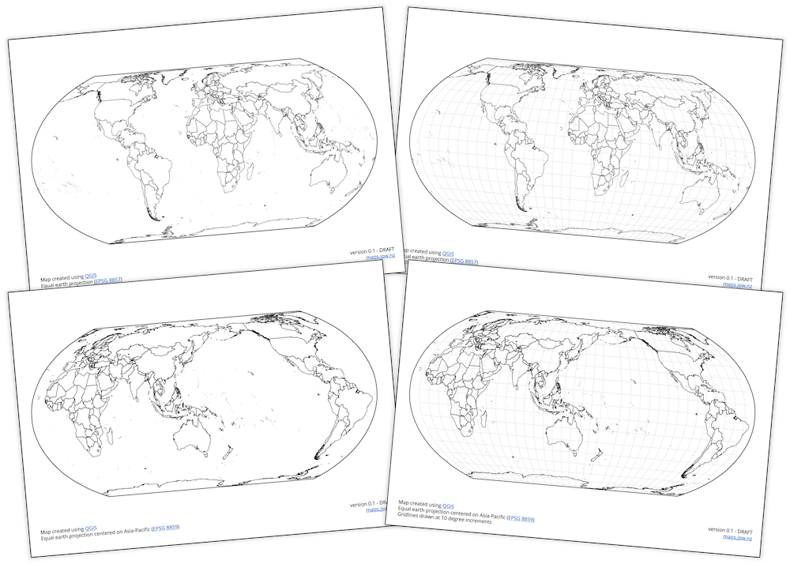

# [Maps](https://maps.jpw.nz)
Created to support the geography / social science teachers at my school.

Maps are created using [QGIS](https://qgis.org/)

There are four versions of the maps, and a file with [all 4 maps](Equal Earth Maps - All Maps.pdf)

Equal earth projection centered on Asia-Pacific ([EPSG 8859](https://epsg.io/8859))
- [One with gridlines every 10 degrees](Equal Earth Maps - Asia-Pacific Gridlines.pdf)
- [One with no gridlines](Equal Earth Maps - Asia-Pacific No Gridlines.pdf)

Equal earth projection ([EPSG 8857](https://epsg.io/8857))
- [One with gridlines every 10 degrees](Equal Earth Maps - Greenwich Gridlines.pdf)
- [One with no gridlines](Equal Earth Maps - Greenwich No Gridlines.pdf)

[maps.jpw.nz](https://maps.jpw.nz)
